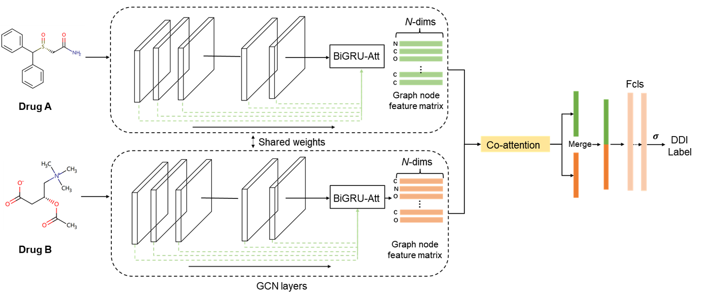

# DDI-GCN: Drug-Drug Interaction Prediction via Explainable Graph Convolutional Networks
# Introduction
**Drug-drug interactions (DDIs)** account for over 30% of all adverse drug reactions (ADRs) cases and often occur when a patient takes two or more drugs. Many DDIs have been reported, but the underlying mechanisms are poorly understood. Predicting potential DDIs is beneficial to reduce side effects and improve drug safety. Here, we introduce **DDI-GCN**,
which utilizes Graph Convolutional Networks (GCN) and co-attention neural networks to identify DDIs and visualize substructures that may be associated with DDIs. Besides, DDI-GCN predicts DDI types that are related to DDI pharmacology.

   

## Data
**DDI-GCN** was trained and tested on DDI binary and categorial classification tasks, where the binary task is to predict whether a drug pair can cause DDI (Task 1) and the categorical task identifies the biological mechanism or consequence if the DDI exists (Task 2). For Task 1, all the collected DDIs from DrugBank 5.1.3 were labeled as the positive set and an equally sized negative set was generated by either the positive-unlabeled learning (PULearn). For Task 2, we identified 106 types of DDI biological mechanisms or consequences with over 100 samples in each type. As a result, we collected 1,948,436 drug pairs for Task 1 and 96,7202 DDIs with labeled DDI types for Task 2, containing 2,755 and 2,689 drugs, respectively.
The data can be downloaded from [here](https://wengzq-lab.cn/ddi/DDI_GCN_data.zip) 

## Dependencies 
DDI-GCN is implemented on the basic running environment below.
* Python == 3.6.8
* [Tensorflow](https://www.tensorflow.org) == 1.15
* [numpy](https://numpy.org/) == 1.18.5
* [rdkit](https://www.rdkit.org/) == 2020.09.1

## Usage
The folder Binary/Negative sampling contains the code for binary task where the DDI negatives are from PULearn sampling.
The folder Binary/Randomized sampling contains the code for binary task where the DDI negatives random sampling.
The folder Categorical contains the code for categorial task.
Download the [data](https://wengzq-lab.cn/ddi/DDI_GCN_data.zip), and put the ***.csv files to the corresponding folder. 
Then run by
   * python train_ddi.py
